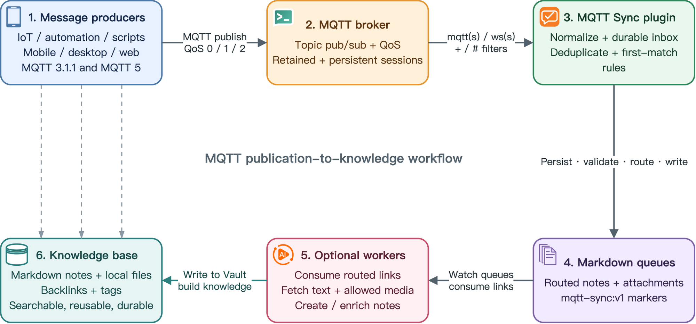
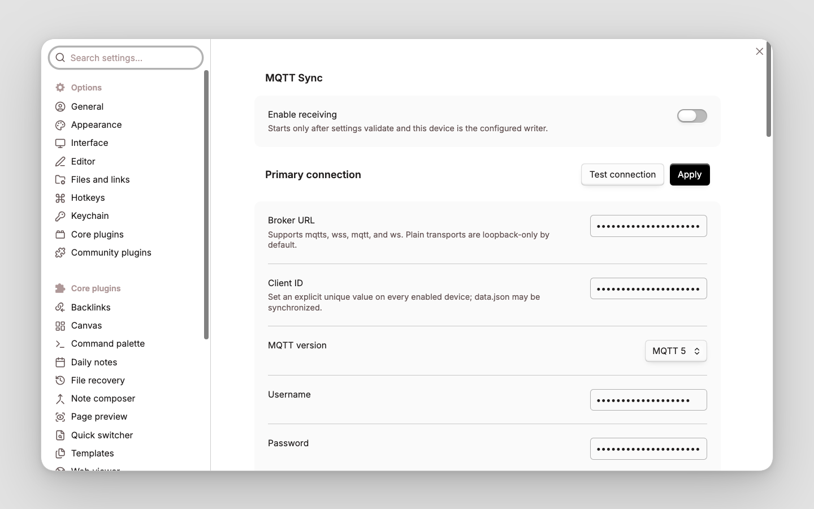
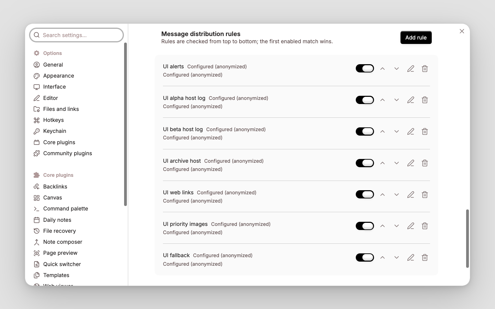
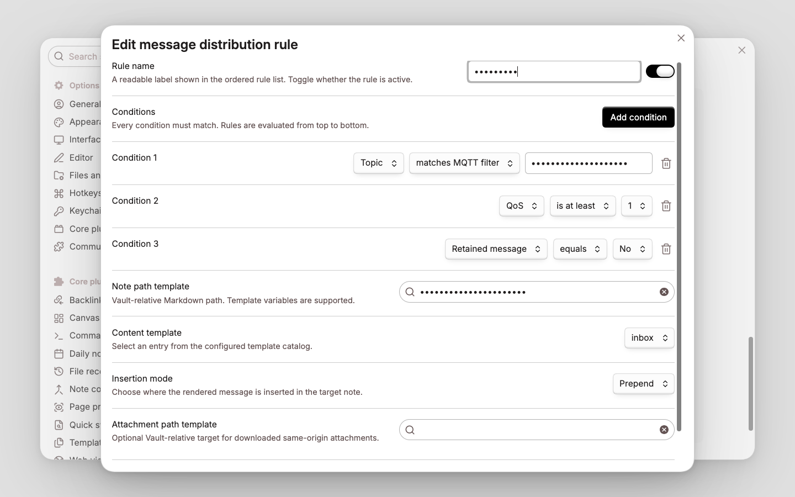

# MQTT Sync

[English](README.md) | [简体中文](README_CN.md)

MQTT Sync connects Obsidian desktop to an MQTT Broker. Publications from devices, gateways, scripts, applications, and automation are normalized and persisted before they are routed into Markdown notes by ordered, first-match rules. Rules can match MQTT delivery metadata, message content, envelope fields, URLs, and attachments; templates control the target note, inserted block, insertion mode, and attachment path.

The plugin supports MQTT 3.1.1 and MQTT 5 over TCP, TLS, WebSocket, and secure WebSocket transports. It includes durable recovery, Vault idempotency markers, bounded attachment downloads, redacted diagnostics, runtime status, and optional result publication. MQTT Sync is desktop-only and requires Obsidian 1.12.7 or newer.

## Message flow



1. **Message sources** — sensors, gateways, services, CLI tools, Web clients, and automation publish bounded MQTT messages.
2. **MQTT Broker** — authenticates clients, routes topics, applies QoS and retained/session behavior, and exposes TCP or WebSocket transports.
3. **MQTT Sync transport** — subscribes with MQTT 3.1.1 or MQTT 5, normalizes publication data, and persists accepted messages before business processing.
4. **First-match routing** — ordered rules select one note target, content template, insertion mode, and optional attachment target.
5. **Markdown notes** — receive deterministic message blocks and the forced `mqtt-sync:v1` marker; approved attachments become local Vault files.
6. **Result and knowledge workflows** — an optional outbox publishes processing results while Obsidian links, tags, search, and downstream automation organize the local notes.

## Features

### Connectivity

- MQTT 3.1.1 and MQTT 5 over `mqtt`, `mqtts`, `ws`, and `wss`.
- Username/password authentication, platform trust roots, custom CA bundles, and optional mutual TLS.
- MQTT topic filters with `+` and terminal `#`; QoS 0/1/2; retained-message handling; Clean Start; Session Expiry; keepalive; bounded reconnect backoff.
- MQTT 5 content type, payload format indicator, user properties, response topic, and correlation data retained in the normalized record.
- Temporary **Test connection** handshake that does not subscribe and is cancelled when the plugin unloads.

### Durable routing

- Accepted publications are persisted before processing in a checksum-protected JSON state file with backup recovery.
- Identity precedence uses envelope ID, explicitly enabled stable correlation data, retained-message key, then a bounded time-bucket fingerprint.
- Ordered rule cards support enable/disable, add, edit, two-step delete, priority arrows, structured AND conditions, revision tracking, and reload-safe persistence.
- Strict Vault-relative note and attachment paths, searchable path fields, configurable insertion modes, and a forced idempotency marker.
- Optional HTTPS attachment downloads with exact-origin, redirect, timeout, size, and digest controls.
- Optional post-commit result outbox with minimal or Vault-path privacy modes and loop-overlap rejection.

### Operation and maintenance

- Theme-aware status indicator for off, monitor-only, idle, connecting, connected, retrying, and error states.
- Redacted status details and diagnostics; reconnect, dead-letter retry, and diagnostic-export commands.
- Safe disable/unload closes MQTT clients and timers without deleting existing Vault content or recoverable state.
- English and Simplified Chinese interfaces, with **Follow Obsidian** as the default and persistent language overrides.
- Searchable settings on Obsidian 1.13+, with the same imperative UI retained for Obsidian 1.12.7.

## Initial configuration

If MQTT is new to you, first confirm that your Broker and another MQTT client can publish and subscribe to one synthetic test topic. Broker administration, ACL design, and certificate issuance are outside this plugin.

1. Create a dedicated input topic namespace and, if needed, a separate result topic. Apply the smallest Broker ACLs that satisfy each direction.
2. Open **Settings → Community plugins → MQTT Sync**. Enter the Broker URL and a stable Client ID that is unique for every enabled device and connection.
3. Select MQTT 3.1.1 or MQTT 5. For MQTT 5 persistent sessions, disable Clean Start and set a non-zero Session Expiry.
4. Configure an input Topic Filter and requested QoS. `+` matches one level; `#` is valid only as a complete terminal level.
5. Prefer `mqtts://` or `wss://`. Configure username/password and, when required, use the dedicated TLS dialog for a custom CA or client certificate/key pair.
6. Review **Message distribution rules**. Rules are evaluated top-to-bottom; use arrows to change priority and the structured editor to configure conditions and actions.
7. Optionally publish results to a concrete topic that cannot be matched by any enabled input filter. Result retain is off by default.
8. Select **Test connection**, then **Apply**. Enable receiving only after validation succeeds and this synchronized Vault copy is the configured writer.

Rules can be created before Broker setup is complete. Plain remote `mqtt://` and `ws://` require an explicit insecure-transport opt-in; TLS verification itself cannot be disabled.

## Configuration screenshots

The screenshots use synthetic settings. Credentials, Broker identifiers, Topic values, Client IDs, paths, and rule values are masked or anonymized.

### General settings

Receiving is disabled until the complete configuration validates. **Test connection** and **Apply** remain beside the **Primary connection** heading. The connection section contains Broker identity, MQTT version, authentication, transport policy, TLS, session, and subscription controls.



### Rule list

Rules use the full section width and are checked from top to bottom. Each card provides enable/disable, move up/down, edit, and two-step delete controls; **Add rule** is attached to the section heading.



### Rule configuration

- Disabled rules are skipped; the first enabled rule whose conditions all match wins.
- Conditions inside one rule use **AND** logic. Create multiple rules with the same action to express OR.
- A rule without conditions matches every message, so a catch-all rule should normally be last.
- Rule changes persist independently of incomplete Broker settings.

| Setting | Description |
| --- | --- |
| **Rule name** | Readable label shown in the ordered list; it does not affect matching. |
| **Enabled** | Includes or excludes the rule without deleting it. |
| **Conditions** | Every condition must match. **Add condition** appends an AND condition; no conditions means match all. |
| **Note path template** | Vault-relative Markdown target ending in `.md`. Absolute paths, `.`/`..`, empty components, and Vault escape are rejected. |
| **Content template** | Selects a configured template. Every rendered block also receives the forced `mqtt-sync:v1` marker. |
| **Insertion mode** | **Append**, **Prepend**, or **After heading**. |
| **Heading** | Required for **After heading** and matched as an exact trimmed Markdown heading; a missing heading is created. |
| **Attachment path template** | Optional Vault-relative target used only when attachment downloading is enabled and security checks pass; otherwise the message remains link-only. |



These are selected, privacy-reviewed images from the maintained English/Simplified Chinese multi-resolution UI matrix.

#### Conditions

Text matching is literal and case-sensitive. Empty text values are invalid. `priority` uses the envelope range 1–5; `qos` uses 0–2.

| Field | Operators | Matched value |
| --- | --- | --- |
| **Topic** | `equals`, `contains`, `starts with`, `matches MQTT Filter` | Original publication Topic. Filter matching follows MQTT `+`, `#`, and `$` namespace rules. |
| **Title** | `equals`, `contains`, `starts with` | Optional envelope title; missing title is empty. |
| **Message body** | `equals`, `contains`, `starts with` | Normalized UTF-8 body; comparisons are not regular expressions. |
| **Has tag** | `contains` | One complete, case-sensitive envelope tag. |
| **Priority** | `equals`, `is at least` | Envelope priority from 1 through 5. |
| **QoS** | `equals`, `is at least` | Received MQTT QoS metadata from 0 through 2. |
| **Retained message** | `equals` with Yes/No | MQTT retain flag. |
| **Duplicate delivery flag** | `equals` with Yes/No | MQTT duplicate-delivery diagnostic flag; it is not a durable identity. |
| **Content type** | `equals`, `contains`, `starts with` | Normalized MQTT 5 publication content type; missing value is empty. |
| **Response topic** | `equals`, `contains`, `starts with` | MQTT 5 response topic; missing value is empty. |
| **Has correlation data** | `equals` with Yes/No | Whether MQTT 5 correlation data is present. |
| **Has attachment** | `equals` with Yes/No | Whether the envelope describes an attachment, not whether download succeeded. |
| **Has HTTP URL** | `equals` with Yes/No | Whether the normalized title/body contains an HTTP(S) URL. |
| **Attachment MIME type** | `equals`, `starts with` | Declared MIME type; searchable presets include exact types and families such as `image/`. |
| **First URL host** | `host equals`, `host or subdomain of` | IDNA-normalized hostname of the first HTTP(S) URL, without scheme, port, or path. |

Operator meanings:

- `equals` compares the complete value; text comparisons are case-sensitive.
- `contains` performs a literal substring check, except **Has tag**, where it checks one complete array item.
- `starts with` performs a literal prefix check; `image/` matches a MIME family.
- `matches MQTT Filter` applies MQTT Topic Filter grammar and namespace behavior.
- `is at least` is a numeric `>=` comparison.
- `host equals` matches one normalized hostname; `host or subdomain of` also accepts subdomains while preserving domain boundaries.

Example order:

1. **MQTT alerts** — Topic / matches MQTT Filter / `sensors/+/alert` and QoS / is at least / `1` → `MQTT Sync/Alerts.md`.
2. **Image attachments** — Has attachment / Yes and Attachment MIME type / starts with / `image/` → `MQTT Sync/Images.md`.
3. **Inbox fallback** — no conditions → `MQTT Sync/Inbox.md`.

## Message envelope

Valid UTF-8 payloads can be used directly through `{{payload}}`. To provide stable identity and structured metadata, publish this JSON envelope:

```json
{
  "schema": "obsidian.mqtt-sync.message.v1",
  "id": "unique-producer-id",
  "text": "Message body",
  "title": "Optional title",
  "tags": ["optional"],
  "priority": 3,
  "url": "https://example.com/item",
  "attachment": {
    "url": "https://files.example.com/a.png",
    "name": "a.png",
    "contentType": "image/png",
    "size": 1234,
    "sha256": "optional lowercase SHA-256"
  }
}
```

Unknown future envelope fields are retained for compatibility but are not automatically exposed to templates or actions.

## Template variables

Note paths, attachment paths, and content templates use the variables below. Date/time values render in UTC. Supported date tokens are `YYYY`, `MM`, `DD`, `HH`, `hh`, `mm`, `ss`, and `SSS` with safe separators.

| Variable | Value |
| --- | --- |
| `{{content}}`, `{{payload}}`, `{{content:N}}` | Full normalized body, or its first `N` characters. |
| `{{title}}`, `{{topic}}`, `{{messageId}}` | Envelope title, source Topic, and normalized stable message ID. |
| `{{qos}}`, `{{retain}}`, `{{priority}}` | Delivery QoS/retain metadata and envelope priority. |
| `{{tags}}`, `{{tag:[N]}}` | Comma-separated tags or zero-based tag `N`. |
| `{{contentType}}`, `{{responseTopic}}`, `{{correlationData}}` | Normalized MQTT 5 metadata; missing values render empty. |
| `{{userProperty:key}}` | Comma-separated values for one MQTT 5 user-property key. |
| `{{url1}}`, `{{url1:host}}` | First HTTP(S) URL and its normalized hostname. |
| `{{attachment:name}}`, `{{attachment:type}}` | Declared attachment name and MIME type. |
| `{{messageDate:FORMAT}}`, `{{messageTime:FORMAT}}` | Publication time in the requested UTC format. |
| `{{receivedDate:FORMAT}}` | Local receipt time in the requested UTC format. |
| `{{file:path}}`, `{{file:link}}`, `{{file:embed}}` | Downloaded file path, wikilink, and embed; empty when no attachment target exists. |

Unsupported variables are rejected during validation. Dynamic path components are sanitized, and the final path must still be Vault-relative and valid.

## Delivery and device model

MQTT QoS is a transport guarantee, not Vault exactly-once. MQTT Sync persists accepted messages and applies this identity precedence:

1. Envelope `id`.
2. Explicitly enabled stable correlation data.
3. Retained-message stable key.
4. Bounded time-bucket fingerprint.

Within one configured writer device, retained state, and retained markers, this provides Vault effective-once behavior. Identical non-retained payloads without a stable ID are coalesced within the default 10-minute window; producers that intentionally repeat identical content should provide unique envelope IDs.

Phase 1 allows one active MQTT Sync writer/subscriber per synchronized Vault. Keep other synchronized copies disabled. Synced `deviceId`, `writerDeviceId`, and Client IDs do not prove physical-device identity.

## Status indicator

The status-bar icon distinguishes **off**, **monitor only**, **idle**, **connecting**, **connected**, **retrying**, and **error**. Connecting uses subtle motion unless the operating system requests reduced motion.

Double-click the icon to open **Settings → MQTT Sync**. Keyboard users can focus it and press Enter or Space. Hover or focus shows receiving/writer state, connection-state counts, subscription count, relative activity times, reconnect/fault codes, inbox totals, and result-outbox pending count. It never displays Broker URLs, Topic values, Client IDs, credentials, payloads, PEM, or raw errors.

## Runtime commands

- **MQTT Sync: Reconnect** — stop current transports and recreate them from validated settings.
- **MQTT Sync: Retry dead-letter messages** — requeue failures without erasing their error history.
- **MQTT Sync: Export redacted diagnostics** — write a payload/credential/Topic-safe report under `Obsidian/MQTT/`.

## Recovery and rollback

Runtime state is stored beside the plugin as `state-v1.json`, with a checksum and previous-snapshot backup. A corrupt primary is isolated and recovered from backup; if both copies are unusable, the plugin stops instead of silently rebuilding and replaying everything. Result publication is outboxed only after the Vault commit and cannot roll it back.

To roll back, disable receiving and the plugin, preserve `data.json`, `state-v1.json`, and its backup, then install the previous package. Disabling closes MQTT clients, reconnect timers, processors, and outbox work without deleting existing notes or attachments. Do not delete state as a normal rollback step.

## Requirements and build

- Obsidian 1.12.7 or newer on desktop.
- Node.js 22 or newer for development.

```sh
npm ci
npm run verify
```

The installable files are `main.js`, `manifest.json`, and `styles.css`. To install into the explicit isolated test Vault:

```sh
npm run build
OBSIDIAN_MQTT_TEST_VAULT=/absolute/path/to/vanotes-test npm run install:test-vault
```

For a manual installation, copy the three installable files into `<Vault>/.obsidian/plugins/mqtt-sync/`, reload Obsidian, and enable **MQTT Sync**. Never use a production Vault as an automated test target.

## Automated acceptance

| Command | Coverage |
| --- | --- |
| `npm run verify` | Formatting, lint, type checking, unit/contract/integration tests, coverage, secret scan, build, reproducibility, and release-package checks; no public Broker access. |
| `npm run test:e2e` | Per-scenario process-internal Aedes and isolated foreground Mosquitto interoperability on loopback. |
| `npm run test:ui` | Installs into `vanotes-test`, exercises DOM, rule mutations, TLS, language, persistence, viewport evidence, and complete cleanup. |
| `npm run test:acceptance` | Runs the maintained acceptance orchestration and reports passed, failed, blocked, and skipped prerequisites separately. |
| `npm run test:e2e:public:mosquitto` | Explicitly enabled public interoperability only; excluded from every default quality gate. |

Reports are written under ignored `.artifacts/` directories.

## Security and known limits

- Credentials and optional TLS PEM are stored in Obsidian `data.json`; filesystem and Vault Sync permissions are the security boundary.
- Payload default is 256 KiB with a 1 MiB hard cap. Attachment default is 15 MiB with a 100 MiB hard cap; downloads are off by default.
- Attachments require exact HTTPS origins and bounded redirects, size, timeout, and optional digest verification. Broker credentials are never forwarded.
- JSON depth is limited to 32; user properties to 64 pairs; correlation/property values to 8 KiB.
- No shell execution, JavaScript templates, remote code, absolute filesystem paths, unrestricted redirects, remote retained-message deletion, or TLS verification bypass.
- Persistent sessions can recover only messages retained by the Broker under its policy. MQTT Sync is not a 24×7 collector and cannot receive while Obsidian is closed.
- Public Broker results are point-in-time interoperability evidence, not performance, production, availability, or long-term stability guarantees.

See [SECURITY.md](SECURITY.md) and the [contributing guide](CONTRIBUTING.md).

## License

AGPL-3.0-only.
