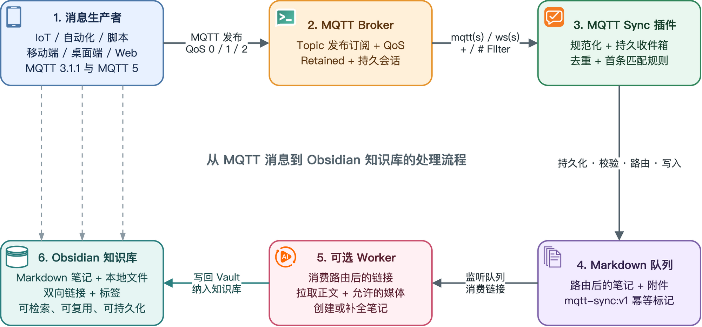
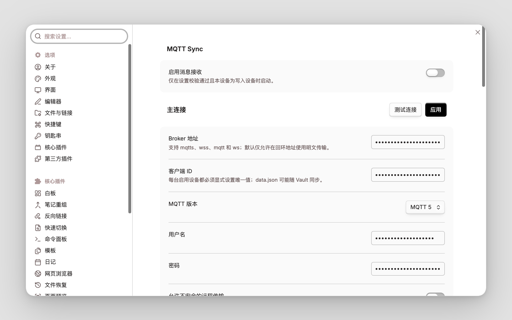
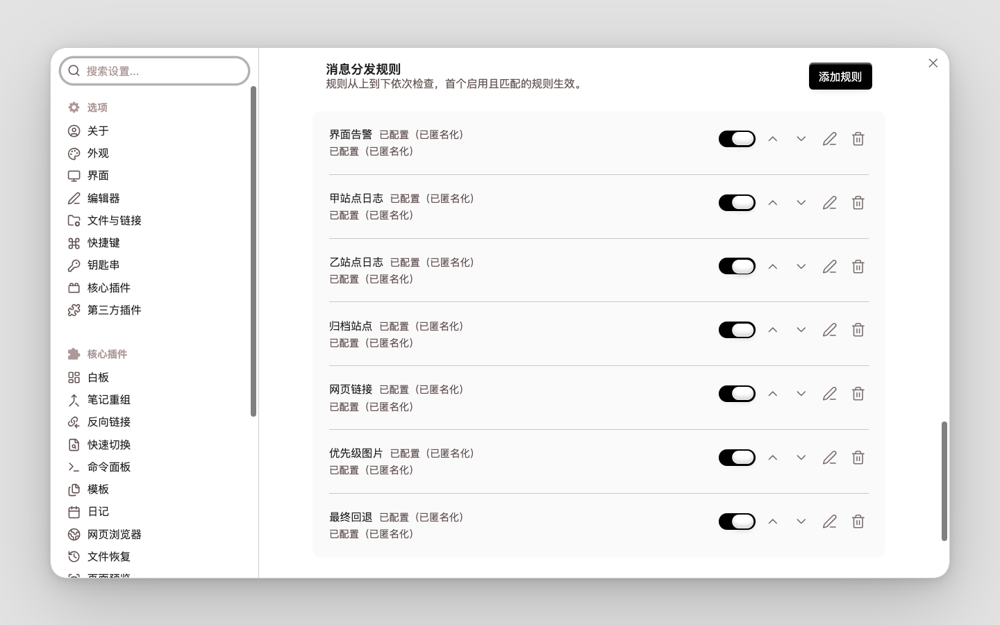
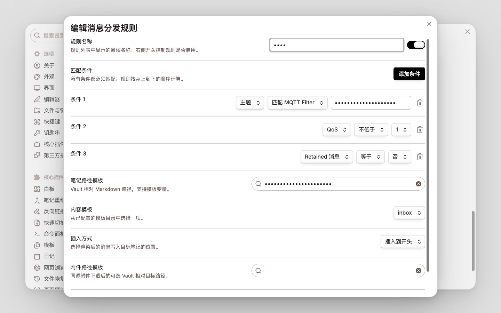

# MQTT Sync

[English](README.md) | [简体中文](README_CN.md)

MQTT Sync 将桌面端 Obsidian 连接到 MQTT Broker。设备、网关、脚本、应用和自动化系统发布的消息会先规范化并持久化，再按有序的首条匹配规则路由到 Markdown 笔记。规则可匹配 MQTT 投递元数据、消息内容、envelope 字段、URL 和附件；模板用于控制目标笔记、写入内容、插入方式和附件路径。

插件支持基于 TCP、TLS、WebSocket 和安全 WebSocket 的 MQTT 3.1.1 与 MQTT 5，并提供持久恢复、Vault 幂等标记、受限附件下载、脱敏诊断、运行状态和可选结果发布。MQTT Sync 仅支持桌面端，需要 Obsidian 1.12.7 或更高版本。

## 消息处理流程



1. **消息来源** — 传感器、网关、服务、CLI、Web 客户端和自动化系统发布有界 MQTT 消息。
2. **MQTT Broker** — 验证客户端、路由 Topic、执行 QoS 与 Retained/Session 行为，并提供 TCP 或 WebSocket 传输。
3. **MQTT Sync transport** — 通过 MQTT 3.1.1 或 MQTT 5 订阅，规范化消息，并在业务处理前持久化已接收内容。
4. **首条匹配路由** — 有序规则选择唯一的目标笔记、内容模板、插入方式和可选附件目标。
5. **Markdown 笔记** — 接收确定性的消息块和强制 `mqtt-sync:v1` 标记；通过安全校验的附件保存为 Vault 本地文件。
6. **结果与知识工作流** — 可选 outbox 发布处理结果，Obsidian 的链接、标签、搜索和下游自动化继续组织本地笔记。

## 功能特性

### 连接能力

- 支持基于 `mqtt`、`mqtts`、`ws`、`wss` 的 MQTT 3.1.1 与 MQTT 5。
- 支持用户名/密码、系统信任根、自定义 CA bundle 和可选双向 TLS。
- 支持 MQTT `+`、末尾 `#` Topic Filter、QoS 0/1/2、Retained Message、Clean Start、Session Expiry、keepalive 和有界重连退避。
- 保留 MQTT 5 content type、payload format indicator、user properties、response topic 与 correlation data。
- 内置有界的**测试连接**握手，不订阅 Topic，并在插件卸载时取消。

### 持久化与路由

- 消息在处理前写入带 checksum 和备份恢复的 JSON 持久状态。
- 身份优先级为 envelope ID、显式启用的稳定 correlation data、Retained 稳定键、时间分桶指纹。
- 有序规则卡片支持启停、新增、编辑、二次确认删除、优先级调整、结构化 AND 条件、revision 和 reload 后持久化。
- 使用严格的 Vault 相对笔记/附件路径、可搜索路径输入框、可配置插入方式和强制幂等标记。
- 可选 HTTPS 附件下载带精确 Origin、重定向、超时、大小和摘要限制。
- 可选的提交后结果 outbox 支持最小信息或包含 Vault 路径的隐私模式，并拒绝结果 Topic 与输入 Filter 重叠。

### 运行与维护

- 主题自适应状态图标可区分关闭、仅监控、空闲、连接中、已连接、重试中和错误。
- 状态详情与诊断均脱敏；提供重连、死信重试和诊断导出命令。
- 安全停用/卸载会关闭 MQTT client 和 timer，但不会删除已有 Vault 内容或可恢复状态。
- 完整支持 English 与简体中文，默认跟随 Obsidian，也可保存明确的语言覆盖。
- Obsidian 1.13+ 支持设置搜索，同时为 Obsidian 1.12.7 保留相同的命令式设置界面。

## 初始配置

如果尚不熟悉 MQTT，请先确认 Broker 与另一个 MQTT 客户端能在一个合成测试 Topic 上完成发布和订阅。Broker 管理、ACL 设计和证书签发不属于本插件职责。

1. 创建专用输入 Topic namespace；如需结果发布，再创建独立结果 Topic，并配置满足每个方向的最小 Broker ACL。
2. 打开**设置 → 第三方插件 → MQTT Sync**，填写 Broker URL，以及每个启用设备和连接都唯一的稳定 Client ID。
3. 选择 MQTT 3.1.1 或 MQTT 5。使用 MQTT 5 持久 Session 时，关闭 Clean Start 并设置非零 Session Expiry。
4. 配置输入 Topic Filter 和请求 QoS。`+` 匹配一级；`#` 只能作为完整的末尾层级。
5. 优先使用 `mqtts://` 或 `wss://`。按需填写用户名/密码，并在独立 TLS 弹窗中配置自定义 CA 或客户端证书/私钥对。
6. 检查**消息分发规则**。规则从上到下计算；使用箭头调整优先级，通过结构化编辑器配置条件和动作。
7. 可选把处理结果发布到无法被任何启用输入 Filter 命中的具体 Topic；结果 retain 默认关闭。
8. 先执行**测试连接**，再点击**应用**。只有设置通过校验且本同步 Vault 副本是写入设备时，才启用接收。

Broker 尚未配置完成时也可以编辑规则。远程明文 `mqtt://`、`ws://` 必须显式允许不安全传输；TLS 证书校验本身不能关闭。

## 配置界面

截图全部使用合成设置；凭据、Broker 标识、Topic、Client ID、路径和规则值已经掩码或匿名化。

### 通用配置

完整配置通过校验前不会启用接收。**测试连接**和**应用**位于**主连接**标题右侧。连接分区包含 Broker 身份、MQTT 版本、认证、传输策略、TLS、Session 与订阅配置。



### 规则列表

规则铺满分区宽度并从上到下计算。每张卡片提供启停、上移/下移、编辑和二次确认删除；**添加规则**位于分区标题右侧。



### 规则配置

- 禁用规则会被跳过；第一条所有条件都匹配的启用规则生效。
- 同一规则中的条件是 **AND（且）**；需要 OR（或）时，应创建多条 action 相同的规则。
- 没有条件的规则匹配全部消息，因此 catch-all 通常应放在最后。
- 规则修改可以独立于未完成的 Broker 设置持久化。

| 配置项 | 说明 |
| --- | --- |
| **规则名称** | 有序列表中的易读名称，不参与匹配。 |
| **已启用** | 启用或停用规则，但不删除它。 |
| **匹配条件** | 所有条件都必须匹配；**添加条件**会新增一个 AND 条件；无条件表示匹配全部。 |
| **笔记路径模板** | 以 `.md` 结尾的 Vault 相对目标；拒绝绝对路径、`.`/`..`、空组件和 Vault 逃逸。 |
| **内容模板** | 选择已配置模板；每个消息块仍会强制附加 `mqtt-sync:v1` 标记。 |
| **插入方式** | **追加到末尾**、**插入到开头**或**插入到标题后**。 |
| **标题** | 选择插入到标题后时必填，按去除首尾空白后的完整 Markdown heading 匹配；不存在时创建。 |
| **附件路径模板** | 仅在附件下载已启用且通过安全校验时使用的可选 Vault 相对目标；否则保留为 link-only。 |



以上图片选自维护中的 English/简体中文多分辨率 UI 矩阵，并已完成人工隐私审查。

#### 条件说明

文本匹配是区分大小写的字面匹配，空文本无效。`priority` 使用 envelope 的 1～5，`qos` 使用 0～2。

| 字段 | 操作符 | 匹配值 |
| --- | --- | --- |
| **Topic** | `等于`、`包含`、`开头为`、`匹配 MQTT Filter` | 原始消息 Topic；Filter 匹配遵循 MQTT `+`、`#` 和 `$` namespace 规则。 |
| **标题** | `等于`、`包含`、`开头为` | 可选 envelope 标题；缺失时为空。 |
| **消息正文** | `等于`、`包含`、`开头为` | 规范化 UTF-8 正文；不是正则表达式。 |
| **包含标签** | `包含` | 一个完整且区分大小写的 envelope tag。 |
| **优先级** | `等于`、`不低于` | 1～5 的 envelope priority。 |
| **QoS** | `等于`、`不低于` | 0～2 的 MQTT 接收 QoS 元数据。 |
| **Retained 消息** | `等于` + 是/否 | MQTT retain 标志。 |
| **重复投递标志** | `等于` + 是/否 | MQTT duplicate 诊断标志，不是持久身份。 |
| **内容类型** | `等于`、`包含`、`开头为` | 规范化的 MQTT 5 publication content type；缺失时为空。 |
| **响应主题** | `等于`、`包含`、`开头为` | MQTT 5 response topic；缺失时为空。 |
| **包含关联数据** | `等于` + 是/否 | 是否存在 MQTT 5 correlation data。 |
| **包含附件** | `等于` + 是/否 | Envelope 是否描述附件，不代表下载成功。 |
| **包含 HTTP URL** | `等于` + 是/否 | 规范化标题/正文是否包含 HTTP(S) URL。 |
| **附件 MIME 类型** | `等于`、`开头为` | 声明的 MIME type；可搜索预设包含具体类型和 `image/` 等类型族。 |
| **第一个 URL 主机名** | `主机名等于`、`主机名或其子域` | 第一个 HTTP(S) URL 的 IDNA 规范化 hostname，不含 scheme、port 或 path。 |

操作符含义：

- `等于`比较完整值；文本字段区分大小写。
- `包含`执行字面子串匹配；对于**包含标签**，检查 tag 数组中的完整元素。
- `开头为`执行字面前缀匹配；`image/` 可匹配整个 MIME 类型族。
- `匹配 MQTT Filter`执行 MQTT Topic Filter 语法和 namespace 规则。
- `不低于`是数值 `>=`。
- `主机名等于`只匹配一个规范化 hostname；`主机名或其子域`还接受保持域名边界的子域。

示例顺序：

1. **MQTT 告警** — Topic / 匹配 MQTT Filter / `sensors/+/alert` 且 QoS / 不低于 / `1` → `MQTT Sync/Alerts.md`。
2. **图片附件** — 包含附件 / 是 且附件 MIME 类型 / 开头为 / `image/` → `MQTT Sync/Images.md`。
3. **Inbox 回退** — 无条件 → `MQTT Sync/Inbox.md`。

## 消息 Envelope

合法 UTF-8 payload 可以直接通过 `{{payload}}` 使用。如需稳定身份和结构化元数据，可发布以下 JSON envelope：

```json
{
  "schema": "obsidian.mqtt-sync.message.v1",
  "id": "生产者唯一 ID",
  "text": "正文",
  "title": "可选标题",
  "tags": ["可选标签"],
  "priority": 3,
  "url": "https://example.com/item",
  "attachment": {
    "url": "https://files.example.com/a.png",
    "name": "a.png",
    "contentType": "image/png",
    "size": 1234,
    "sha256": "可选的小写 SHA-256"
  }
}
```

未知的未来 envelope 字段会为兼容性保留，但不会自动暴露给模板或动作。

## 模板变量

笔记路径、附件路径和内容模板支持以下变量。日期时间按 UTC 渲染，可使用 `YYYY`、`MM`、`DD`、`HH`、`hh`、`mm`、`ss`、`SSS` 和安全分隔符。

| 变量 | 值 |
| --- | --- |
| `{{content}}`、`{{payload}}`、`{{content:N}}` | 完整规范化正文或前 `N` 个字符。 |
| `{{title}}`、`{{topic}}`、`{{messageId}}` | Envelope 标题、来源 Topic 和规范化稳定消息 ID。 |
| `{{qos}}`、`{{retain}}`、`{{priority}}` | 投递 QoS/retain 元数据和 envelope priority。 |
| `{{tags}}`、`{{tag:[N]}}` | 逗号分隔的 tags 或从 0 开始的第 `N` 个 tag。 |
| `{{contentType}}`、`{{responseTopic}}`、`{{correlationData}}` | 规范化 MQTT 5 元数据；缺失时为空。 |
| `{{userProperty:key}}` | 指定 MQTT 5 user-property key 的逗号分隔值。 |
| `{{url1}}`、`{{url1:host}}` | 第一个 HTTP(S) URL 及其规范化 hostname。 |
| `{{attachment:name}}`、`{{attachment:type}}` | 声明的附件名称和 MIME type。 |
| `{{messageDate:FORMAT}}`、`{{messageTime:FORMAT}}` | 按指定 UTC 格式渲染的发布时间。 |
| `{{receivedDate:FORMAT}}` | 按指定 UTC 格式渲染的本地接收时间。 |
| `{{file:path}}`、`{{file:link}}`、`{{file:embed}}` | 下载文件路径、wikilink 和 embed；没有附件目标时为空。 |

不支持的变量会在校验阶段被拒绝。动态路径组件会被清理，最终路径仍必须是合法的 Vault 相对路径。

## 交付与设备模型

MQTT QoS 是传输保证，不代表 Vault exactly-once。插件持久化已接收消息，并使用以下身份优先级：

1. Envelope `id`。
2. 显式启用的稳定 correlation data。
3. Retained Message 稳定键。
4. 有界时间分桶指纹。

在单一写入设备、持久状态和幂等标记仍存在的边界内，插件提供 Vault effective-once。没有稳定 ID 的相同非 Retained payload 会在默认 10 分钟内合并；需要重复处理相同内容的生产者应提供唯一 envelope ID。

第一阶段只允许同一同步 Vault 内一个活跃的 MQTT Sync writer/subscriber，其他同步副本应保持禁用。同步的 `deviceId`、`writerDeviceId` 和 Client ID 不能证明物理设备身份。

## 状态图标

状态栏图标可区分**关闭**、**仅监控**、**空闲**、**连接中**、**已连接**、**重试中**和**错误**。连接中使用轻微动画；操作系统要求 reduced motion 时自动关闭动画。

双击图标可打开**设置 → MQTT Sync**；键盘用户聚焦后可按 Enter 或空格。鼠标悬停或键盘聚焦会显示接收/写入设备状态、连接状态数量、订阅数、相对活动时间、重连/故障代码、inbox 总数和 result-outbox 待处理数。浮层绝不显示 Broker URL、Topic、Client ID、凭据、payload、PEM 或原始错误。

## 运行时命令

- **MQTT Sync：重新连接** — 停止当前 transport，并根据已校验设置重新创建。
- **MQTT Sync：重试死信消息** — 重新排队失败消息，不删除其错误历史。
- **MQTT Sync：导出脱敏诊断信息** — 在 `Obsidian/MQTT/` 下写入不含 payload、凭据和 Topic 的报告。

## 恢复与回滚

运行状态保存在插件旁的 `state-v1.json`，带 checksum 和上一快照备份。主文件损坏时会被隔离并从备份恢复；两份都不可用时插件会停止，而不是静默重建并重新处理全部内容。结果只在 Vault 提交后进入 outbox，不能回滚已经完成的写入。

回滚时先关闭接收并禁用插件，保留 `data.json`、`state-v1.json` 及其备份，再安装旧包。禁用会关闭 MQTT client、重连 timer、processor 和 outbox 工作，但不会删除已有笔记或附件。不要把删除状态文件当作正常回滚步骤。

## 环境要求与构建

- 桌面端 Obsidian 1.12.7 或更高版本。
- 开发环境 Node.js 22 或更高版本。

```sh
npm ci
npm run verify
```

可安装文件为 `main.js`、`manifest.json` 和 `styles.css`。安装到明确的隔离测试 Vault：

```sh
npm run build
OBSIDIAN_MQTT_TEST_VAULT=/绝对路径/vanotes-test npm run install:test-vault
```

手动安装时，将三个文件复制到 `<Vault>/.obsidian/plugins/mqtt-sync/`，重载 Obsidian 并启用 **MQTT Sync**。不得把生产 Vault 用作自动测试目标。

## 自动化验收

| 命令 | 验收范围 |
| --- | --- |
| `npm run verify` | 格式、lint、类型检查、单元/契约/集成测试、覆盖率、秘密扫描、构建、可复现性和发布包检查；不访问公共 Broker。 |
| `npm run test:e2e` | 在回环地址逐场景运行进程内 Aedes 和隔离前台 Mosquitto 互操作测试。 |
| `npm run test:ui` | 安装到 `vanotes-test`，验证 DOM、规则变更、TLS、语言、持久化、viewport 证据和完整清理。 |
| `npm run test:acceptance` | 运行维护的验收编排，并分别报告 passed、failed、blocked、skipped 前置条件。 |
| `npm run test:e2e:public:mosquitto` | 仅在显式启用时进行公网互操作；不进入任何默认质量门。 |

报告写入已忽略的 `.artifacts/`。

## 安全与已知限制

- 凭据和可选 TLS PEM 存储在 Obsidian `data.json` 中；本地文件系统与 Vault Sync 权限是安全边界。
- Payload 默认 256 KiB、硬上限 1 MiB；附件默认 15 MiB、硬上限 100 MiB，下载默认关闭。
- 附件必须使用精确 HTTPS Origin，并受重定向、大小、超时和可选摘要限制；绝不转发 Broker 凭据。
- JSON 深度上限 32；user property 最多 64 对；correlation/property 值上限 8 KiB。
- 不执行 shell、JavaScript 模板或远程代码；不允许绝对文件路径、无限制重定向、远程 Retained Message 删除和 TLS 校验绕过。
- 持久 Session 只能恢复 Broker 按其策略保留的消息。Obsidian 关闭时无法接收，MQTT Sync 不是 24×7 采集器。
- 公共 Broker 结果只是时点互操作证据，不构成性能、生产、可用性或长期稳定性保证。

参见[安全策略](SECURITY.md)与[贡献指南](CONTRIBUTING.md)。

## 许可证

AGPL-3.0-only。
